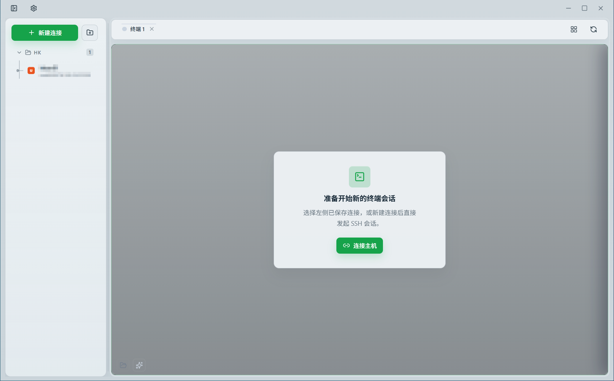
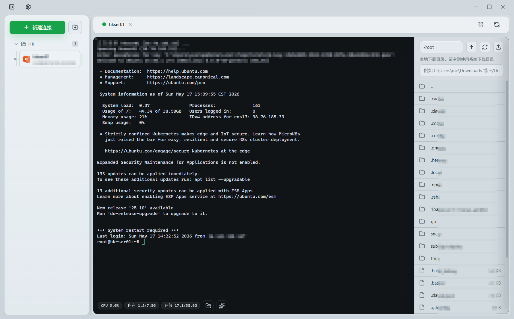
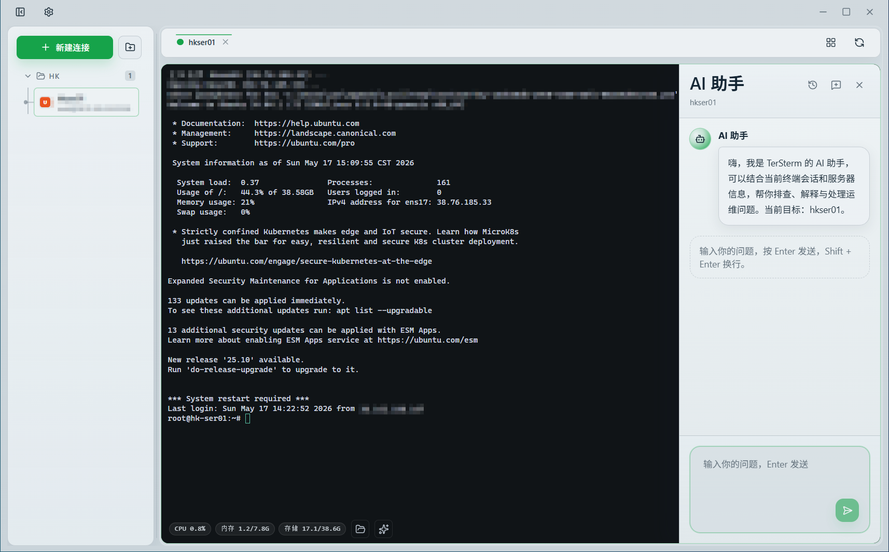

# TerSterm

TerSterm 是一个基于 Tauri 2、Rust、React 18、TypeScript、Radix UI、Tailwind CSS 和 xterm.js 的桌面 SSH 管理工具，面向需要同时管理多台 Linux 服务器的日常运维场景。

当前仓库版本已经具备连接管理、多终端分屏、同步输入、远程文件管理、Zmodem 传输、AI 运维辅助、多主机 Runbook、深链快速会话、托盘行为控制和 GitHub Release 自更新等能力。

## 界面预览

<p align="center">
  
  <br />
  <sub>连接管理与多终端工作区</sub>
</p>
<p align="center">
  
  <br />
  <sub>分屏终端与远程资源概览</sub>
</p>
<p align="center">
  
  <br />
  <sub>远程文件管理、传输与设置面板</sub>
</p>

## 当前功能

- 连接管理
  - 新建、编辑、删除、测试 SSH 连接
  - 支持按分组管理连接，并支持搜索连接和分组
  - 连接信息保存在本机浏览器存储中，重启应用后仍可保留
- 认证方式
  - 支持用户名 + 密码
  - 支持私钥路径
  - 支持直接粘贴私钥内容
  - 支持私钥口令，并在会话中自动捕获本次输入的口令继续后续远程操作
- 终端工作区
  - 基于 xterm.js 的交互式 SSH 终端
  - 单屏、双屏、三屏、四分屏布局
  - 会话标签切换、关闭、状态显示
  - 多个已连接终端之间的同步输入广播
- 远程操作
  - 远程文件列表浏览
  - 文件上传、下载
  - 支持拖放上传
  - 支持新建目录、删除远程文件或目录
  - 支持读取和修改远程文件权限、所有者，并可递归应用到子目录
  - 支持配置本地下载目录
  - 支持 Zmodem 收发文件，并展示传输进度、速度和剩余时间
  - 展示远端 CPU、内存、磁盘占用
- AI 运维辅助
  - 支持 OpenAI 兼容接口和 Anthropic 接口
  - 支持自定义接口地址、模型、API Key 与系统提示词
  - 支持结合当前终端会话和服务器上下文进行故障排查、命令解释与操作建议
  - 支持仅回复、仅代填命令、批准后执行等终端权限控制
  - 支持为多台已连接主机生成可审阅的 Runbook，并按步骤串行或并行分发执行
- 桌面能力
  - 中英文界面切换
  - 多套界面主题、浅色/深色/跟随系统模式，以及分析面板主题色切换
  - 关闭窗口时可选择最小化到托盘或直接退出
  - 单实例运行
  - 通过 GitHub Release 检查更新、下载安装包并拉起安装程序
  - 支持 `tersterm://` 深链快速打开会话

## 运行要求

- Node.js 20+
- `pnpm`
- Rust stable
- Tauri 2 构建环境
- 系统中可用的 `ssh`、`scp` 与 `ssh-keygen`

Windows 下建议直接使用系统自带的 OpenSSH Client，并确保 `ssh.exe`、`scp.exe`、`ssh-keygen.exe` 可在 `PATH` 中找到。

## 快速开始

安装依赖：

```bash
pnpm install
```

启动桌面开发环境：

```bash
pnpm tauri:dev
```

只预览前端界面：

```bash
pnpm dev
```

`pnpm dev` 运行的是浏览器预览模式，会走 `src/bridge.ts` 里的 mock 桥接逻辑，适合调界面，不等同于真实 SSH/Tauri 运行时。

预览已构建的前端产物：

```bash
pnpm preview
```

## 构建

前端构建：

```bash
pnpm build
```

桌面安装包构建：

```bash
pnpm tauri:build
```

不同平台的桌面安装包构建需要满足对应系统的 Tauri 2 构建环境要求，例如 WebView、编译工具链、平台 SDK 和打包工具等。

## 校验

前端类型检查与打包：

```bash
pnpm build
```

Rust 检查与测试：

```bash
cargo check --manifest-path src-tauri/Cargo.toml
cargo test --manifest-path src-tauri/Cargo.toml
```

Windows 下可额外检查应用退出后是否残留 SSH 相关进程：

```bash
pnpm check:process-cleanup
```

## 深链快速会话

应用注册了 `tersterm://` 协议，可通过深链创建或直接打开会话。

示例：

```text
tersterm://connect?host=192.168.1.10&username=root
tersterm://connect?host=192.168.1.10&username=root&port=22&name=Prod
tersterm://connect?host=192.168.1.10&username=root&group=生产环境&save=true&connect=true
tersterm://192.168.1.10?username=root
```

支持的常用参数：

- `host` / `hostname` / `ip`
- `username` / `user` / `login`
- `port`
- `name` / `title`
- `group` / `group_id` / `folder`
- `password` / `pass`
- `private_key_path` / `key_path` / `identity`
- `private_key` / `key`
- `private_key_passphrase` / `passphrase`
- `save=true|false`
- `connect=true|false`

默认行为是保存到连接列表并立即发起连接。

## 技术说明

- 前端：React 18 + TypeScript + Radix UI + Tailwind CSS + xterm.js
- 桌面容器：Tauri 2
- 后端：Rust

交互式 SSH 会话由 Rust 后端通过 `portable-pty` 启动系统 `ssh` 客户端，终端输入、输出、resize 通过 Tauri command/event 在前后端之间同步。

远程文件列表、上传下载、连接测试和资源采集优先走 `ssh2`，在需要时会回退到 OpenSSH 命令执行。

AI 助手通过本地配置的 OpenAI 兼容接口或 Anthropic 接口调用模型。API Key 和模型配置仅保存在本地应用配置中，终端命令输入或执行受用户选择的权限模式限制。

应用更新能力直接读取 GitHub Releases，并按当前平台选择合适的安装包下载与拉起。

## 当前限制

- 已保存的连接信息目前存放在本机 `localStorage` 中，不是系统级安全凭据存储。
- AI 助手配置和会话历史同样保存在本地应用配置或本地存储中，请自行保护本机环境安全。
- 交互式终端依赖系统 `ssh` 客户端可用。
- 远端资源监控当前面向 Linux 主机，依赖 `/proc/stat`、`/proc/meminfo` 和 `df`。
- 部分远程文件能力在 OpenSSH 回退路径下依赖远端存在 `sh`、`base64` 等常见工具。
- 深链、托盘、自动更新等桌面能力仅在 Tauri 运行时可用，浏览器预览模式不可用。

## 项目结构

```text
src/                 React 前端与终端界面
src/components/      终端面板组件
src-tauri/           Rust 后端与 Tauri 配置
scripts/             开发辅助脚本
```

## License

MIT
